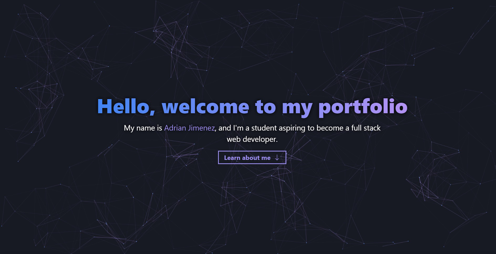

# Module 20 React portfolio challenge

## Description

This is Adrian Jimenez's module 20 react portfolio challenge submission. 

This project is a simple one page portfolio using react, and other knowledge we've learned throughout the coding bootcamp courses to improve upon the original module 2 portfolio. Overall I see a major improvement in quality and spent alot of time ensuring that the page was responsive and that the animations functioned as intended.

## Table of Contents

- [Installation](#installation)
- [Languages](#languages)
- [Usage](#usage)
- [Credits](#credits)
- [License](#license)
- [Contributing](#contributing)
- [Questions](#questions)

## Installation

In order to install this project, download all files and have node.js installed on your machine. Navigate to the root directory and type: 

    npm install

Once all dependencies have been downloaded, you can start the react development server by typing npm start

## Technologies Used

* JavaScript
* Node.JS
* React
* CSS
* HTML
* Chakra UI

## Usage

In order to use this project, please make sure you have node.js intalled on your machine. Once that is set up, simply execute npm start and the application should start. Alternatively, visit the site [here](https://frozen-journey-17981.herokuapp.com/)

## Credits

* Adrian Jimenez

## License

This project is licensed under the MIT License. See [LICENSE.md](./LICENSE.md) for more details.

---

## Contributing

This project follows the contributor covenant contribution guidelines. See [here](https://www.contributor-covenant.org/version/2/1/code_of_conduct/) 

## Questions

If you have any questions or concerns visit my [github](https://github.com/PuppetAJ) or send me an email at <adrianjimenez1950@gmail.com>. 

